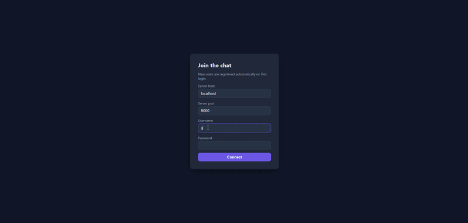
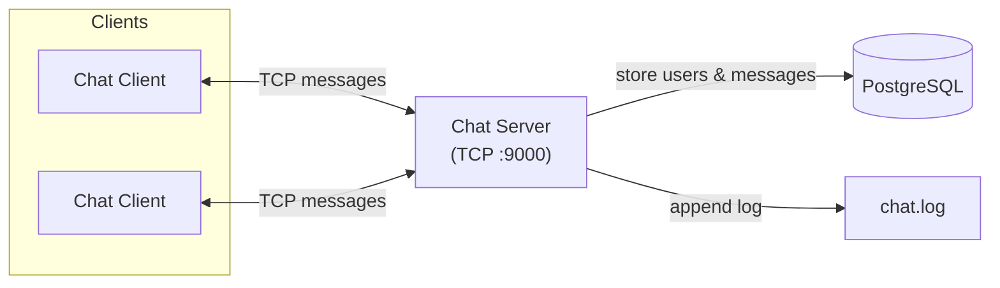
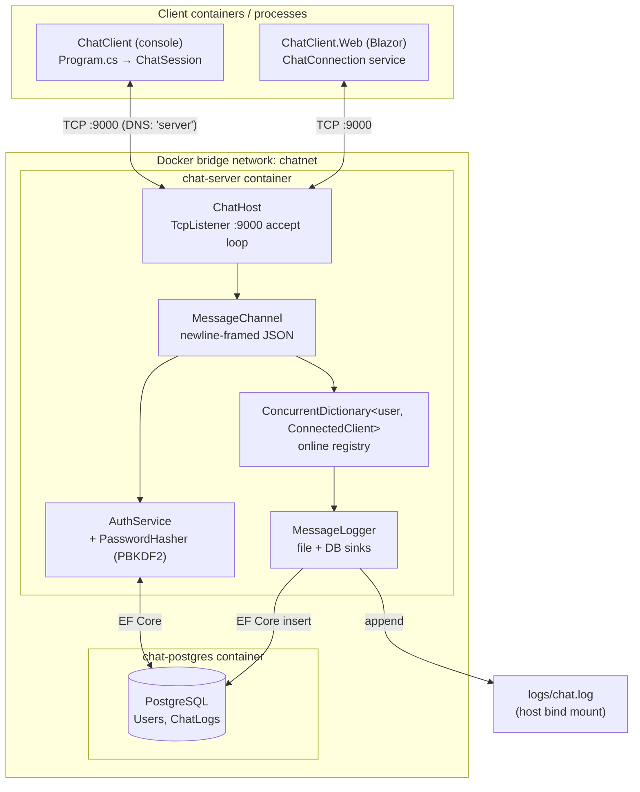

# Containerized Messenger Application

A simple, multi-client messaging platform built with **C# / .NET 8** using **low-level TCP sockets**
(`System.Net.Sockets`). The server and clients run as separate Docker containers and
communicate over a Docker bridge network, with chat history persisted in **PostgreSQL**
via **EF Core (code-first)**.



---

## Features

| Feature | Category | Status |
|---------|----------|:------:|
| Multi-threaded socket server (task-per-connection) | Required | ✅ |
| Broadcast messaging to all connected clients | Required | ✅ |
| Timestamped logging to file | Required | ✅ |
| Graceful client disconnect handling | Required | ✅ |
| Client auto-reconnect with exponential backoff | Required | ✅ |
| Configurable host/port via environment variables | Required | ✅ |
| Dockerized server & client | Required | ✅ |
| Docker Compose multi-container orchestration | Required | ✅ |
| Docker DNS service-name resolution | Required | ✅ |
| Authentication (username + password, PBKDF2) | Bonus | ✅ |
| Auto-registration of new users | Bonus | ✅ |
| Private messaging (`/msg <user> <text>`) | Bonus | ✅ |
| Persistent storage in PostgreSQL (EF Core code-first) | Bonus | ✅ |
| Online user list (`/list`) | Extra | ✅ |
| Blazor web UI client | Extra | ✅ |
| Automated unit & integration tests (xUnit) | Extra | ✅ |
| Azure deployment (Container Apps, Bicep IaC) | Extra | ✅ |

### Highlevel architecture



- **Clients** connect over TCP and exchange messages through the server.
- **Server** broadcasts messages to all clients and handles private messages.
- **PostgreSQL** persists users and chat history.
- **chat.log** keeps a timestamped file log.

#### Container & component architecture



- **Clients** — a console client and a Blazor web client, both speaking the same newline-framed JSON protocol.
- **ChatHost** — accepts connections, authenticates them, and maintains the in-memory online registry.
- **MessageChannel** — frames and serializes messages over the TCP stream.
- **MessageLogger** — writes every chat message to both PostgreSQL and the bind-mounted `chat.log` file.


### Core requirements

- **Multi-threaded socket server** — accepts many simultaneous clients, each handled on its own asynchronous task.
- **Broadcast messaging** — messages from any client are relayed to all connected clients.
- **Timestamped logging** — every message is written to a log file (`logs/chat.log`) *and* to PostgreSQL.
- **Graceful disconnect handling** — unexpected drops are detected, the client is removed, and others are notified.
- **Auto-reconnect client** — the client retries with exponential backoff when the connection is lost.
- **Configurable** — host/port and database settings come from environment variables.
- **Docker DNS resolution** — clients reach the server by its Compose service name (`server`).

### Bonus features (all implemented)

- **Authentication** — clients must supply a username + password. Unknown users are auto-registered; known users are verified against a PBKDF2-hashed password.
- **Private messaging** — `/msg <user> <text>` delivers a direct message to a single online user.
- **Persistent storage** — users and all chat messages are stored in PostgreSQL using EF Core code-first migrations.
- **Online users** — Use `/list` to list users who are currently online.

---

## Project structure

```
chat-application/
├── src/
│   ├── Shared/            # Wire protocol: Message, MessageType, MessageChannel (newline-framed JSON)
│   ├── ChatServer/        # TCP server, auth, EF Core data layer, file+DB logging
│   │   ├── Auth/          # PasswordHasher (PBKDF2), AuthService
│   │   ├── Data/          # Entities, DbContext, migrations, factories
│   │   ├── Logging/       # MessageLogger (file + database)
│   │   └── Server/        # ChatHost (accept loop, broadcast, private routing)
│   ├── ChatClient/        # Console client with auto-reconnect
│   └── ChatClient.Web/    # Blazor web UI client
│       ├── Components/    # Razor components (App, Routes, Layout, Pages)
│       ├── Services/      # ChatConnection (TCP bridge to the server)
│       └── wwwroot/       # Static assets (app.css)
├── tests/
│   ├── Shared.Tests/      # Protocol: Message, MessageChannel (loopback)
│   ├── ChatServer.Tests/  # Auth, password hashing, logging, ChatHost integration
│   └── ChatClient.Tests/  # Client config and ChatSession (loopback)
├── docker/
│   ├── Dockerfile.server
│   ├── Dockerfile.client
│   └── Dockerfile.web     # Blazor web UI image (for Azure)
├── infra/                 # Azure deployment (Container Apps)
│   ├── main.bicep         # ACR, PostgreSQL, Log Analytics, storage, Container App
│   ├── main.parameters.json
│   └── deploy.ps1         # Two-pass deploy (builds images via 'az acr build')
├── docker-compose.yml     # postgres + server + client services on one network
└── README.md
```

---

## Protocol

Communication is **newline-delimited JSON** over TCP. Each message is a single line of
UTF-8 JSON terminated by `\n`. This keeps the protocol dependency-free (no chat framework)
while remaining structured and easy to debug.

| Type         | Direction        | Purpose                                   |
|--------------|------------------|-------------------------------------------|
| `Auth`       | client → server  | Login / auto-register (username+password) |
| `AuthResult` | server → client  | Success/failure of authentication         |
| `Chat`       | both             | Broadcast message                         |
| `Private`    | both             | Direct message to one user                |
| `System`     | server → client  | Join/leave notices, errors, usage hints   |

---

## Configuration (environment variables)

### Server
| Variable            | Default            | Description                     |
|---------------------|--------------------|---------------------------------|
| `SERVER_PORT`       | `9000`             | TCP port to listen on           |
| `LOG_FILE_PATH`     | `logs/chat.log`    | Path to the append-only log     |
| `POSTGRES_HOST`     | `localhost`        | Database host                   |
| `POSTGRES_PORT`     | `5432`             | Database port                   |
| `POSTGRES_DB`       | `chatdb`           | Database name                   |
| `POSTGRES_USER`     | `chat`             | Database user                   |
| `POSTGRES_PASSWORD` | `chatpassword`     | Database password               |

### Client
| Variable        | Default     | Description                                   |
|-----------------|-------------|-----------------------------------------------|
| `SERVER_HOST`   | `localhost` | Server hostname (Compose service name `server`) |
| `SERVER_PORT`   | `9000`      | Server port                                   |
| `CHAT_USERNAME` | *(prompt)*  | Username; if unset, the client prompts        |
| `CHAT_PASSWORD` | *(prompt)*  | Password; if unset, the client prompts        |

---

## Build & run with Docker Compose


Pre-requisites : 
  - Docker desktop installed
  - .NET SDK 8 installed with runtime hosting bundles
  - clone the repository and navigate to respective directory and follow the below steps.

### 1. Build the solution
```powershell
docker compose build
```

### 2. Start PostgreSQL and the server
```powershell
docker compose up -d postgres server
```
The server waits for PostgreSQL to be healthy, applies EF Core migrations automatically,
then begins listening on port `9000`.

You can follow server logs with:
```powershell
docker compose logs -f server
```

### 3. Start one or more clients - CLI based approach
Open a **separate terminal for each client** and run:
```powershell
docker compose run --rm client
```
Each invocation prompts for a username and password (any values — new users are registered
automatically). Repeat in additional terminals to simulate multiple participants.

> Using `docker compose run` (rather than `up`) gives each client its own interactive
> terminal, which is what a console chat client needs.

### 4. (Optional) Start the web UI client - UI based approach
The Blazor web client (`ChatClient.Web`) offers a browser-based alternative to the console
client. It runs locally and connects to the server that Compose already published on
`localhost:9000`, so no extra container is required — just the .NET 8 SDK.

```powershell
dotnet run --project src/ChatClient.Web
```
Then open **http://localhost:5080** in your browser, log in with any username/password, and
start chatting. Open the page in multiple browser tabs (or alongside a console client) to see
real-time broadcast and private messaging across all participants.

> The UI reads `SERVER_HOST` / `SERVER_PORT` (defaults `localhost` / `9000`). Override them if
> your server runs elsewhere, e.g. `$env:SERVER_HOST="localhost"; $env:SERVER_PORT="9000"`.

### 5. Chat
- Type a message and press **Enter** to broadcast it to everyone.
- List: `/list` : List down all online users
- Send a private message: `/msg <username> <message>`
- Quit: `/quit`

### 6. Shut down
```powershell
docker compose down          # stop containers
docker compose down -v       # also remove the PostgreSQL volume
```

---

## Demonstrating multi-client messaging

1. `docker compose up -d postgres server`
2. Terminal A: `docker compose run --rm client` → log in as `alice`
3. Terminal B: `docker compose run --rm client` → log in as `bob`
4. In A, type `hello everyone` → it appears in B as `alice: hello everyone`.
5. In B, type `/msg alice hi there` → only A receives `[private] bob -> alice: hi there`.
6. Close B's terminal (Ctrl+C) → A shows `[system] bob left the chat.`
7. Inspect persisted history:
   ```powershell
   docker compose exec postgres psql -U chat -d chatdb -c "SELECT \"SenderUsername\", \"Recipient\", \"IsPrivate\", \"Content\", \"Timestamp\" FROM \"ChatLogs\" ORDER BY \"Timestamp\";"
   ```
8. Inspect the file log: `logs/chat.log` on the host (bind-mounted from the server).

---

## Running locally without Docker (optional)

Requires the .NET 8 SDK and a reachable PostgreSQL instance.

```powershell
# Server (set DB env vars to point at your PostgreSQL)
$env:POSTGRES_HOST="localhost"
dotnet run --project src/ChatServer

# Client (in another terminal)
$env:SERVER_HOST="localhost"
dotnet run --project src/ChatClient
```

Migrations are applied automatically on server startup. To create/update migrations
manually:
```powershell
dotnet ef migrations add <Name> --project src/ChatServer --startup-project src/ChatServer -o Data/Migrations
```

---

## Running the tests

The solution ships with xUnit test projects under `tests/` covering the shared protocol,
the server (auth, password hashing, logging, and full loopback integration of `ChatHost`),
and the client (config plus a loopback `ChatSession`). The server tests use the EF Core
in-memory provider, so **no database or Docker is required**.

Run the whole suite from the repository root:
```powershell
dotnet test ChatApp.slnx
```

Run a single project, e.g. only the server tests:
```powershell
dotnet test tests/ChatServer.Tests
```

---

## Design decisions & trade-offs

- **Sockets, not frameworks.** The transport is raw `TcpListener` / `TcpClient` with a
  hand-written framing layer (`MessageChannel`), satisfying the "low-level socket
  programming" requirement.
- **Newline-delimited JSON.** Chosen over a fixed binary protocol for readability and
  easy extensibility. Framing by `\n` avoids partial-message issues from TCP's stream nature.
- **Task-per-connection concurrency.** Each client runs on its own async task over the
  thread pool (see the *Concurrency model* section above); the shared client registry is a
  `ConcurrentDictionary`, and outbound writes are serialized per connection via a semaphore
  in `MessageChannel`. This keeps the concurrency model simple and safe without manual
  locking around the socket.
- **Short-lived DbContexts.** A lightweight `IDbContextFactory` creates a fresh
  `ChatDbContext` per operation, which is the recommended pattern for concurrent access
  and avoids sharing a context across threads.
- **Auto-register on first login.** Simplifies the demo; a production system would separate
  registration from login. Passwords are hashed with **PBKDF2 (SHA-256, 100k iterations)**
  and a per-user salt — never stored in plaintext.
- **Migration-on-startup with retry.** The server polls for the database before applying
  migrations, so container start order doesn't cause crashes (in addition to the Compose
  health check).
- **Dual logging.** Messages go to both a file (quick inspection, requirement) and the
  database (durable, queryable — the persistence bonus).
- **Azure Container Apps over AKS.** For the cloud deployment, ACA runs the existing Docker
  images as a managed serverless container service — no Kubernetes cluster to operate. The
  server and web are co-located in one replica so they communicate over `localhost`, avoiding
  the need to expose the raw TCP server publicly; the web UI is the only public endpoint. AKS
  would offer more control (e.g. a `LoadBalancer` service for raw TCP) at a much higher
  operational cost — overkill for this app.

- Concurrency model (how "multi-threaded" is achieved)

  The server handles many clients **concurrently across multiple threads**, but it does so
  using .NET's **task-based asynchronous model over the thread pool** rather than a dedicated
  OS thread per client.

  - The accept loop (`await AcceptTcpClientAsync`) spawns an independent `Task`
  (`HandleClientAsync`) for every connection — see [ChatHost.cs](src/ChatServer/Server/ChatHost.cs).

  - While a connection waits for the next message (`await channel.ReadAsync(...)`), the method
    **suspends and releases its thread back to the thread pool** instead of blocking it. When
    data arrives, the continuation resumes on any available pool thread (backed by OS I/O
    completion ports).

  - Concurrent shared state is therefore accessed from multiple threads and is protected
    accordingly: the connected-client registry is a `ConcurrentDictionary`, and per-connection
    writes are serialized with a `SemaphoreSlim` in [MessageChannel.cs](src/Shared/MessageChannel.cs).

  **Why this instead of `new Thread(...)` per client?** A thread-per-client design pins one OS
  thread (≈1 MB stack) to each connection, most of which sits blocked on a synchronous read.
  The async model services thousands of connections with a small pool of threads proportional
  to the CPU count, giving the same concurrency with far lower memory and context-switching
  overhead. It is the idiomatic, recommended approach for scalable socket servers in modern
  .NET. Functionally it is genuinely multi-threaded — message handling for different clients
  runs in parallel on different threads — it simply does not waste a dedicated thread per idle
  socket.

        | Aspect                  | Thread-per-client             | **This project** (async + thread pool) |
        | ----------------------  | ----------------------------  | -------------------------------------- |
        | Threads for _N_ clients | `N` — one dedicated per client| Small shared pool (~CPU cores)         |
        | While waiting for I/O   | Thread **blocked** on read    | Thread **returned to the pool**        |
        | Memory per idle client  | ~1 MB thread stack            | A few KB of state                      |
        | Context switching       | High under load               | Minimal                                |
        | Scalability             | Limited (hundreds)            | High (thousands)                       |

## Assumptions

- Implementation mainly backend centric + chat interactivity via CLI 
- Out of scope client centric UI (created mainly for presentational use)
- Usernames are unique and case-insensitive; a user may only be connected once at a time.
- Any username/password is accepted on first use (self-service registration) for demo ease.
- Private messages are delivered only when the recipient is currently online.
- Console rendering is line-based; inbound messages may interleave with what a user is
  typing (acceptable for a plain console client, as specified).
- The PostgreSQL credentials in `docker-compose.yml` are for local/demo use only.

